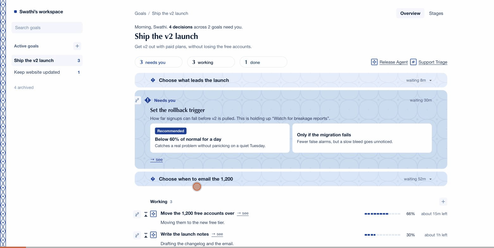

# Human–agent UI experiments

Prototypes for a goal-first agent workspace. Open `index.html` in a browser.
No build step, no dependencies, no network calls.

```
index.html              the prototype — start here
src/
  styles.css            all styling; the palette lives in :root
  data.js               vocabulary, agents, and the two seeded goals
  app.js                behaviour; expects data.js to have loaded first
  data.codex.js         an alternate scenario set; swap it in for data.js
explorations/
  ten-aesthetics.html   ten visual treatments of the same task queue
  split-and-map.html    three ways to make "needs you" prominent, plus ten map layouts
  font-pairings.html    the same screen in ten type pairings, all system-installed
docs/
  concept-summary.md    the original model this was built from
```

Editing is meant to be obvious: change a colour in `src/styles.css`, change the
seeded work in `src/data.js`, change how it behaves in `src/app.js`.

## The model

Every task is in exactly one of three states, and there is no fourth:

- **Needs you** — a decision or action is needed from you.
- **Working** — an agent can continue without you.
- **Completed** — the task produced something ready to use.

Work an agent cannot continue is not a separate state. It is named inside the
decision that is holding it up. Adding work is an action, never a state: new work
inherits everything the agents have worked out so far and carries on from there.

## What the prototype does

- Decisions are real. Each shows two options with their consequences, one marked
  recommended. Clicking one commits immediately and the row that appears offers
  an undo, rather than gating the choice behind a confirm step.
- Numbers are traceable. A decision built on an agent's findings links back to
  the run that produced them.
- Every agent update can be rated, and every completed artifact opens to its
  result, the reasoning, and its sources.
- The three counts at the top double as filters.
- The greeting is workspace-level, not goal-level, so it sits in a pinned band
  above the whole frame and does not change when you switch goals.
- A task is live work, not a record. Clicking a row opens the feed of the agent
  doing it, focused on that task, rather than a properties panel.
- Stages is derived from the tasks themselves, so the two views cannot disagree.
  Connectors are drawn only where a real dependency exists.

## Design constraints it was built under

- Three states, mutually exclusive and collectively exhaustive.
- Plain language throughout: no branch, node, route, artifact, or proof-of-work.
- No box carries a fill and a border of different colours.
- Colour comes from Andalusian azulejo: cobalt, pale glaze, cream and terracotta
  grout. The tile appears in four places, all of them quiet: a border course down
  the left edge, glaze texture on the surface that needs you, each agent as its
  own motif, and progress laid in courses with grout between them. A completed
  task is a single tile, set in green.
- No neutral greys anywhere. Secondary text is tinted plum. States are raspberry
  (needs you), near-black (working), and emerald (completed).
- Rules only where they separate something. Space does the rest.
- One typeface, Avenir Next, with weight and size carrying the hierarchy.

## Published

The cockpit is also live as a private artifact:
https://claude.ai/code/artifact/e4ad5d13-446d-4b71-9ec0-b8fc10fe56fd

## Walkthrough


